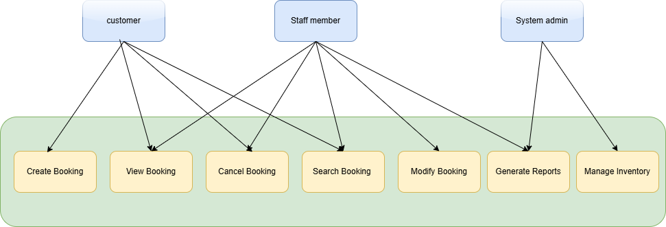

# Requirement Analysis in Software Development

## Introduction

This repository is dedicated to the study and documentation of **Requirement Analysis** in software development.

Requirement analysis is a vital step in the software development lifecycle. It involves gathering, analyzing, and documenting the needs and expectations of stakeholders to create software that aligns with their goals. This process ensures clarity, minimizes misunderstandings, and lays the foundation for building high-quality software.

The purpose of this repository is to:

- Provide an overview of requirement analysis concepts.
- Explore best practices and methodologies.
- Share resources, templates, and tools for effective requirement analysis.

Whether you're a software developer, project manager, or a business analyst, this repository aims to serve as a valuable resource for enhancing your understanding of requirement analysis.

## What is Requirement Analysis?

**Requirement Analysis** is the process of identifying, gathering, analyzing, and documenting the functional and non-functional requirements of a software system. It serves as the foundation of the **Software Development Lifecycle (SDLC)**, ensuring that all stakeholders have a shared understanding of the project goals and deliverables.

### Key Components of Requirement Analysis:

1. **Requirements Gathering**: Collecting input from stakeholders, end-users, and subject matter experts.
2. **Requirements Documentation**: Writing clear and detailed requirements that define what the software should do.
3. **Requirements Validation**: Ensuring that the requirements are accurate, complete, and feasible.
4. **Requirements Prioritization**: Organizing requirements based on their importance and impact on the project.

### Importance of Requirement Analysis in SDLC:

1. **Prevents Miscommunication**: Clear and well-documented requirements minimize misunderstandings between stakeholders and developers.
2. **Reduces Development Risks**: Identifying potential issues early in the process avoids costly changes later.
3. **Improves Project Success**: Ensures that the final product meets user expectations and business objectives.
4. **Facilitates Better Planning**: Provides a clear roadmap for development, resource allocation, and time management.

### Why is it Essential?

Without proper requirement analysis, projects risk being delayed, exceeding budgets, or failing to deliver a product that satisfies stakeholders' needs. By investing time in this phase, organizations can ensure smoother development processes, higher-quality outcomes, and greater customer satisfaction.

## Why is Requirement Analysis Important?

Requirement Analysis is crucial to the success of any software development project. Below are three key reasons why it holds such significance in the Software Development Lifecycle (SDLC):

1. **Enhances Clarity and Communication**  
   Requirement Analysis ensures that all stakeholders—developers, business analysts, end-users, and project managers—have a shared understanding of the project's goals. By documenting clear, concise, and specific requirements, it minimizes the risk of miscommunication, ensuring that everyone is aligned.

2. **Reduces Project Risks and Costs**  
   Identifying potential challenges and ambiguities early in the process helps prevent costly errors during development. By addressing unclear or conflicting requirements in the analysis phase, teams can avoid delays, scope creep, and budget overruns.

3. **Ensures Deliverables Meet User Expectations**  
   Properly analyzed requirements focus on the actual needs of the end-user. This ensures that the final product aligns with user expectations and business objectives, increasing the likelihood of project success and customer satisfaction.

4. **Facilitates Better Resource Allocation**  
   With well-defined requirements, project managers can allocate resources, time, and budget more effectively. This leads to more efficient workflows and ensures that teams work on the right tasks at the right time.

## Key Activities in Requirement Analysis

Requirement Analysis involves several critical activities that help ensure the software development process is built on a solid foundation. Below are the five key activities:

1. **Requirement Gathering**

   - Collect input from stakeholders, end-users, and subject matter experts to identify the needs and objectives of the project.
   - Use methods such as interviews, surveys, workshops, and focus groups to collect information.

2. **Requirement Elicitation**

   - Dig deeper into the needs gathered to understand the underlying goals and priorities.
   - Resolve conflicts between stakeholder requirements and ensure alignment with the project’s scope.

3. **Requirement Documentation**

   - Record the requirements in a clear, structured, and detailed format, such as a Software Requirements Specification (SRS) document.
   - Ensure documentation includes functional, non-functional, and technical requirements.

4. **Requirement Analysis and Modeling**

   - Analyze the gathered requirements to identify feasibility, conflicts, and dependencies.
   - Use modeling techniques such as use case diagrams, flowcharts, or prototypes to visualize the system and its components.

5. **Requirement Validation**
   - Ensure the documented requirements accurately represent stakeholder needs.
   - Use techniques like walkthroughs, peer reviews, and stakeholder approvals to validate and finalize requirements.

## Types of Requirements

Requirements in software development are broadly categorized into **Functional Requirements** and **Non-functional Requirements**. Below, we define each type and provide examples for a booking management project.

### Functional Requirements

Functional requirements define what the system should do. They describe the specific behaviors, tasks, and operations the software must perform to meet user needs.

**Examples for a Booking Management Project:**

- The system should allow users to create, update, and cancel bookings.
- Users should be able to search for available slots by date and time.
- The system should send email notifications to users when a booking is confirmed or canceled.
- Admins should have the ability to view and manage all bookings in the system.

### Non-functional Requirements

Non-functional requirements define how the system should operate. They describe the quality attributes, constraints, and performance metrics of the system.

**Examples for a Booking Management Project:**

- The system should process booking requests within 2 seconds.
- The system should be available 99.9% of the time to ensure reliability.
- The system must support up to 10,000 concurrent users during peak hours.
- The interface should be responsive and accessible on both desktop and mobile devices.

## Use Case Diagrams

### What are Use Case Diagrams?

A **Use Case Diagram** is a visual representation of the interactions between users (actors) and the system. It highlights the key functionalities (use cases) of the system and the roles that interact with them. Use case diagrams are widely used in requirement analysis to capture functional requirements and provide a clear understanding of the system's scope.

### Benefits of Use Case Diagrams:

- Simplifies the representation of system functionality.
- Provides a clear communication tool between stakeholders.
- Helps identify system boundaries and interactions.
- Serves as a guide for developing test cases and system documentation.

### Example: Booking Management System Use Case Diagram

Below is the use case diagram for the booking management system:

---

### Use Case Description:

- **Actors**:
  - **User**: Can search for slots, make bookings, cancel bookings, and receive notifications.
  - **Staff Member**: Can search for slots, make bookings, cancel bookings, and generate reports.
  - **Admin**: Manages bookings and ensures the notification system is functioning.
- **Use Cases**:
  - **Search Available Slots**: Users can search for open booking slots.
  - **Make a Booking**: Users can book a slot based on availability.
  - **Cancel a Booking**: Users can cancel a previously made booking.
  - **Receive Notifications**: Users receive confirmation or cancellation updates via email.
  - **Manage Bookings**: Admin can view, approve, or modify bookings.

## Acceptance Criteria

### What are Acceptance Criteria?

Acceptance Criteria are a set of well-defined conditions that a software product or a specific feature must satisfy to be considered complete and accepted by stakeholders. These criteria are critical for bridging the gap between user expectations and development outcomes.

#### Importance of Acceptance Criteria in Requirement Analysis

- **Aligns Understanding**: Ensures all stakeholders—clients, developers, and testers—are aligned on the definition of “done.”
- **Facilitates Testing**: Provides a benchmark to validate the functionality and usability of a feature.
- **Reduces Rework**: Clearly defined criteria prevent miscommunication and minimize the need for rework.
- **Enhances Quality**: Guarantees that the delivered feature meets business requirements and user needs.

#### Example: Acceptance Criteria for the Checkout Feature

**Feature: Checkout**

1. **Authentication and Authorization**

   - Only authenticated users can proceed to checkout.
   - Guests are prompted to log in or create an account before checking out.

2. **Payment Processing**

   - Multiple payment methods (credit card, PayPal, and mobile wallets) are supported.
   - Payment transactions are processed securely through an external, PCI-compliant payment gateway.

3. **Booking Confirmation**

   - A confirmation page is displayed after successful payment, showing the booking details.
   - An email containing booking information is sent to the user upon completion.

4. **Error Handling**

   - If payment fails, an error message explains the issue, and the user can retry or select another payment method.
   - If room availability changes during the checkout process, the user is notified immediately and directed to update their booking details.

5. **Validation**

   - All required fields (e.g., guest name, check-in/check-out dates, and payment details) must be filled out before proceeding.
   - The system verifies that the selected room is available before completing the booking.

6. **Responsive Design**
   - The checkout process must work seamlessly across desktop, tablet, and mobile devices.
